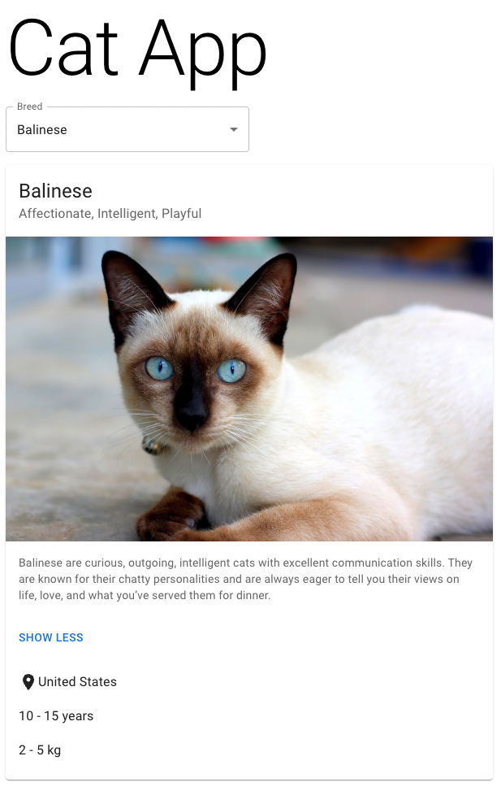

# Cat App

A React application using a public cat API.

**Technologies:** React, Material UI, Axios, Postman

The app is deployed to GitHub pages and available [here](https://eliselarooy.github.io/cat-app/).

## Installation

- Clone this repository onto your machine.
- Use `npm install` to install all dependencies from the package.json file.
- Get a free API key from [The Cat API](https://thecatapi.com/) and add APIKEY=\<your API key\> to a .env file in the root folder.
- Run `npm start` in the root folder.

## API

This app uses a single endpoint from [The Cat API](https://thecatapi.com/). A GET request to https://api.thecatapi.com/v1/breeds returns a list of all breeds. Each breed has a unique 4-character id which is used to populate the dropdown.

## Breed Card

Information about the breed is displayed when a breed is selected from the dropdown. Further details about the breed can be viewed by clicking the ‘Learn More’ button.
